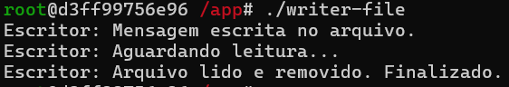
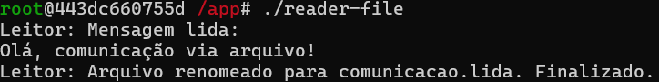

# Relatório da Atividade 5 - Comunicação de Tarefas

| Disciplina | Docente | Discente | Data |
| :--------: | :-----: | :------: | :--: |
| Sistemas Operacionais | Leonardo A. Minora | João Vitor B. da Silva | 13/06/2025 |

<br>

## Objetivo da Atividade

> O objetivo dessa atividade é visualizar e compreender como acontece o compartilhamento de memória entre processos observando o seus comportamentos quando diferentes processos utilizam de um mesmo espaço de memoria e quando utilizam espaços da memoria reservados para cada processo.

<br>

## Etapa 1 - Inicializando Container e Compilando e Testando Processos Writing e Reading

### Código-Fonte C - Writer
```c
#include <stdio.h>
#include <stdlib.h>
#include <string.h>
#include <unistd.h>
#include <fcntl.h>      // Para open(), O_CREAT, etc.
#include <sys/stat.h>   // Para permissões (S_IRUSR, S_IWUSR)

#define FILENAME "comunicacao.txt"

int main() {
    FILE *file;
    const char *message = "Olá, comunicação via arquivo!\n";

    // Abre o arquivo para escrita (cria se não existir, limpa conteúdo existente)
    file = fopen(FILENAME, "w");
    if (file == NULL) {
        perror("fopen");
        exit(1);
    }

    // Escreve a mensagem no arquivo
    fwrite(message, 1, strlen(message), file);
    fclose(file);

    printf("Escritor: Mensagem escrita no arquivo.\n");
    printf("Escritor: Aguardando leitura...\n");

    // Espera até que o leitor termine (verifica se o arquivo foi renomeado)
    while (access(FILENAME, F_OK) == 0) {
        sleep(1);
    }

    printf("Escritor: Arquivo lido e removido. Finalizado.\n");
    return 0;
}
```

<br>

### Código-Fonte C - Reader
```c
#include <stdio.h>
#include <stdlib.h>
#include <unistd.h>

#define FILENAME "comunicacao.txt"
#define TEMPNAME "comunicacao.lida"

int main() {
    FILE *file;
    char buffer[1024];

    // Abre o arquivo para leitura
    file = fopen(FILENAME, "r");
    if (file == NULL) {
        perror("fopen");
        exit(1);
    }

    // Lê o conteúdo do arquivo
    fread(buffer, 1, sizeof(buffer), file);
    fclose(file);

    printf("Leitor: Mensagem lida:\n%s", buffer);

    // Remove o arquivo (sinaliza que terminou)
    if (rename(FILENAME, TEMPNAME) != 0) {
        perror("rename");
        exit(1);
    }

    printf("Leitor: Arquivo renomeado para %s. Finalizado.\n", TEMPNAME);
    return 0;
}
```

<br>




<br>

### **OBSERVAÇÕES**

* O primeiro código fonte C (Write Process) é responsável por escrever um conteúdo em um arquivo e remover após ser lido
    1. Linha 1 (SHELL) - Escreve o conteúdo no arquivo;
    2. Linha 2 (SHELL) - Aguarda a leitura do conteúdo escrito verificando se houve leitura a cada 1 segundo;
    3. Linha 3 (SHELL) - Confirma que o arquivo foi lido e o remove.

* O segundo código fonte C (Reader Process) é responsável por ler o conteúdo de um arquivo
    1. Linha 1 e 2 (SHELL) - Exibi a mensagem do documento (Ler);
    2. Linha 3 (SHELL) - Renomea o arquivo para comunicacao.lida e finaliza a operação.

<br>

## Etapa 2 - Testando Processos Writing e Reading Usando Memória Compartilhada

### Código-Fonte C - Writer Usando Memória Compartilhada
```c
#include <stdio.h>
#include <stdlib.h>
#include <string.h>
#include <sys/ipc.h>
#include <sys/shm.h>
#include <unistd.h>

#define SHM_SIZE 1024  // Tamanho da memória compartilhada

int main() {
    int shmid;
    key_t key = 1234;  // Chave única para a memória compartilhada
    char *shm, *data;

    // Cria um segmento de memória compartilhada
    shmid = shmget(key, SHM_SIZE, IPC_CREAT | 0666);
    if (shmid == -1) {
        perror("shmget");
        exit(1);
    }

    // Anexa o segmento ao espaço de endereçamento do processo
    shm = shmat(shmid, NULL, 0);
    if (shm == (char *)-1) {
        perror("shmat");
        exit(1);
    }

    // Escreve na memória compartilhada
    strcpy(shm, "Olá, Memória Compartilhada!");

    printf("Escritor: Mensagem escrita na memória compartilhada.\n");
    printf("Escritor: Aguardando leitura...\n");

    // Espera até que o leitor sinalize que terminou (modificando o primeiro byte)
    while (*shm != '*') {
        sleep(1);
    }

    // Libera a memória compartilhada
    shmdt(shm);
    shmctl(shmid, IPC_RMID, NULL);  // Remove o segmento

    printf("Escritor: Memória compartilhada liberada.\n");
    return 0;
}
```

<br>

### Código-Fonte C - Reader Usando Memória Compartilhada
```c
#include <stdio.h>
#include <stdlib.h>
#include <sys/ipc.h>
#include <sys/shm.h>
#include <unistd.h>

#define SHM_SIZE 1024

int main() {
    int shmid;
    key_t key = 1234;  // Mesma chave usada no escritor
    char *shm;

    // Obtém o segmento de memória compartilhada
    shmid = shmget(key, SHM_SIZE, 0666);
    if (shmid == -1) {
        perror("shmget");
        exit(1);
    }

    // Anexa o segmento ao espaço de endereçamento do processo
    shm = shmat(shmid, NULL, 0);
    if (shm == (char *)-1) {
        perror("shmat");
        exit(1);
    }

    // Lê a mensagem da memória compartilhada
    printf("Leitor: Mensagem lida: \"%s\"\n", shm);

    // Sinaliza para o escritor que terminou (modificando o primeiro byte)
    *shm = '*';

    // Libera a memória compartilhada
    shmdt(shm);

    printf("Leitor: Finalizado.\n");
    return 0;
}
```

<br>


<br>

### **OBSERVAÇÕES**

* 

<br>

## Etapa 3 - Comparando Processos Writing e Reading Usando Memória Compartilhada com e sem Threads

### Comandos Usados para o Monitoramento:
* `perf stat` - Mede detalhadamente o desempenho de um programa, mostrando:
    1. Quanto tempo a CPU realmente trabalhou;
    2. Quantos recursos foram usados.

<br>

### Código-Fonte C - Writer com Threads
```c
#include <stdio.h>
#include <stdlib.h>
#include <string.h>
#include <unistd.h>
#include <pthread.h>
#include <sys/mman.h>
#include <fcntl.h>

#define SHARED_MEM_NAME "/shared_mem_thread"
#define MESSAGE_SIZE 1024

typedef struct {
    pthread_mutex_t mutex;
    pthread_cond_t cond;
    char message[MESSAGE_SIZE];
    int ready;
} shared_data;

int main() {
    int fd;
    shared_data *shared;
    
    // Criar área de memória compartilhada
    fd = shm_open(SHARED_MEM_NAME, O_CREAT | O_RDWR, 0666);
    if (fd == -1) {
        perror("shm_open");
        exit(EXIT_FAILURE);
    }
    
    // Ajustar o tamanho da memória compartilhada
    if (ftruncate(fd, sizeof(shared_data)) == -1) {
        perror("ftruncate");
        exit(EXIT_FAILURE);
    }
    
    // Mapear a memória compartilhada
    shared = mmap(NULL, sizeof(shared_data), PROT_READ | PROT_WRITE, MAP_SHARED, fd, 0);
    if (shared == MAP_FAILED) {
        perror("mmap");
        exit(EXIT_FAILURE);
    }
    
    // Inicializar mutex e condition variable com atributos para compartilhamento entre processos
    pthread_mutexattr_t mutex_attr;
    pthread_condattr_t cond_attr;
    
    pthread_mutexattr_init(&mutex_attr);
    pthread_mutexattr_setpshared(&mutex_attr, PTHREAD_PROCESS_SHARED);
    pthread_mutex_init(&shared->mutex, &mutex_attr);
    
    pthread_condattr_init(&cond_attr);
    pthread_condattr_setpshared(&cond_attr, PTHREAD_PROCESS_SHARED);
    pthread_cond_init(&shared->cond, &cond_attr);
    
    shared->ready = 0;
    
    // Escrever a mensagem
    pthread_mutex_lock(&shared->mutex);
    strncpy(shared->message, "Olá, comunicação via memória compartilhada com threads!", MESSAGE_SIZE);
    shared->ready = 1;
    printf("Writer: Mensagem escrita. Notificando leitor...\n");
    pthread_cond_signal(&shared->cond);
    pthread_mutex_unlock(&shared->mutex);
    
    // Esperar pela confirmação de leitura
    pthread_mutex_lock(&shared->mutex);
    while (shared->ready != 2) {
        pthread_cond_wait(&shared->cond, &shared->mutex);
    }
    printf("Writer: Confirmação recebida. Mensagem lida pelo leitor.\n");
    pthread_mutex_unlock(&shared->mutex);
    
    // Limpeza
    munmap(shared, sizeof(shared_data));
    shm_unlink(SHARED_MEM_NAME);
    
    return 0;
}
```

<br>

### Código-Fonte C - Reader com Threads
```c
#include <stdio.h>
#include <stdlib.h>
#include <string.h>
#include <unistd.h>
#include <pthread.h>
#include <sys/mman.h>
#include <fcntl.h>

#define SHARED_MEM_NAME "/shared_mem_thread"
#define MESSAGE_SIZE 1024

typedef struct {
    pthread_mutex_t mutex;
    pthread_cond_t cond;
    char message[MESSAGE_SIZE];
    int ready;
} shared_data;

int main() {
    int fd;
    shared_data *shared;
    
    // Abrir área de memória compartilhada
    fd = shm_open(SHARED_MEM_NAME, O_RDWR, 0666);
    if (fd == -1) {
        perror("shm_open");
        exit(EXIT_FAILURE);
    }
    
    // Mapear a memória compartilhada
    shared = mmap(NULL, sizeof(shared_data), PROT_READ | PROT_WRITE, MAP_SHARED, fd, 0);
    if (shared == MAP_FAILED) {
        perror("mmap");
        exit(EXIT_FAILURE);
    }
    
    // Esperar pela mensagem
    pthread_mutex_lock(&shared->mutex);
    while (shared->ready != 1) {
        pthread_cond_wait(&shared->cond, &shared->mutex);
    }
    
    // Ler a mensagem
    printf("Reader: Mensagem recebida: %s\n", shared->message);
    
    // Confirmar leitura
    shared->ready = 2;
    pthread_cond_signal(&shared->cond);
    pthread_mutex_unlock(&shared->mutex);
    
    // Limpeza
    munmap(shared, sizeof(shared_data));
    close(fd);
    
    return 0;
}
```

<br>


<br>

### **OBSERVAÇÕES**

* 

<br>

## Conclusão

> 